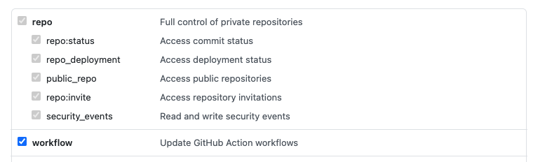

## PR Chunker

This github action helps teams merging smaller PRs to staging environments and eventually production by automatically creating Pull Requests once a certain threshold of lines changed was exceeded. 

**Note**: PR Chunker will only create one Pull Request at the time. But if the trigger is configured to be executed against staging and develop branches the action will automatically trigger after the merge and a new PR will be created if needed.

## Usage

```yaml
name: PR automation
on:
  push:
    branches:
      - develop
      - staging
jobs:
  automate_pr:
    runs-on: ubuntu-latest
    steps:
      - name: Checkout
        uses: actions/checkout@v2
        with:
          fetch-depth: 0
          token: ${{ secrets.ACCESS_TOKEN }}
      - run: |
          git config user.name github-actions
          git config user.email github-actions@github.com
      - uses: sebasrodriguez/pr-chunker@master
        env:
            GITHUB_TOKEN: ${{ secrets.ACCESS_TOKEN }}
        with:
          max-diff: "1000"
          base-branch: "staging"
          main-branch: "develop"
```

A specific personal access token needs to be specified with workflow access to be able to create branches and pull requests.



## Recommendations

Assuming a branching strategy where feature branches are merged onto develop.

Having this environment branches:

- develop
- staging
- main

If develop has multiple commits that haven't been merged onto staging and they pass the specified threshold, pr-chunker will automatically create a PR with the maximum amount of commits before passing the limit so that staging is not too far behind develop.

PR-CHUNKER is best used when the merging strategy to **develop** is squash and merge, the reason for that is because it will ensure that features / fixes are atomic and will avoid partial merges when there are multiple commits.

